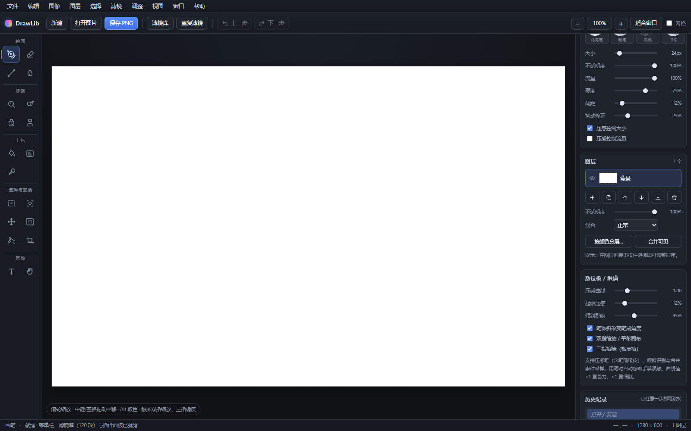
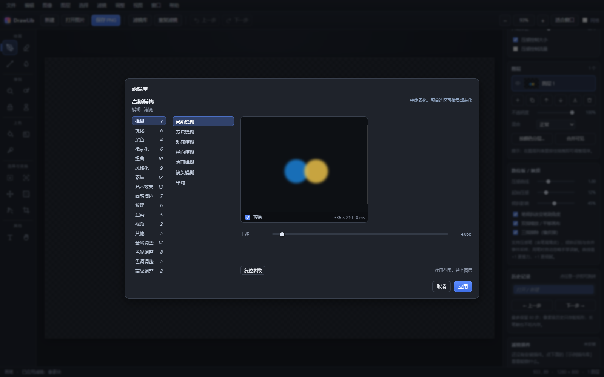

# DrawLib · 绘画工作室

纯前端、零依赖、**双击 index.html 即可使用**的 PNG 绘画软件。深色工作台界面，内置 PS 风格菜单栏、120 个滤镜与调整、插件系统与完整的历史记录。



## 在线试玩

**<https://yxpil.github.io/DrawLib/>**（GitHub Pages，打开即画，所有数据留在本地浏览器）

## 功能一览

**19 个工具**（快捷键无冲突）

| 分组 | 工具 |
|---|---|
| 绘画 | 画笔 B · 橡皮擦 E · 直线 L · 涂抹 U |
| 修饰 | 模糊 R · 减淡/加深/海绵 D · 污点修复 J · 仿制图章 S |
| 上色 | 油漆桶 G · 渐变 F · 吸管 I（放大镜取色） |
| 选择与变换 | 色块选取 M · 对象选择 O · 移动 V · 自由变换 P · 液化 Q · 剪裁 C |
| 其他 | 文字 T · 抓手 H |

- **自由变换**：八向控制点缩放、框内移动、框外旋转，Shift 等比 / 15° 吸附，Enter 应用、Esc 取消
- **笔刷**：8 种笔型 × 大小 / 不透明度 / 流量 / 硬度 / 间距 / 抖动修正，压感与倾斜可调
- **数位板 / 触屏**：压感笔（含笔尾橡皮）、手掌误触忽略、双指缩放平移、三指擦除

**120 个滤镜与调整**（`滤镜库` 一键直达，实时预览）

- 93 个滤镜：模糊、锐化、杂色、像素化、扭曲、风格化、素描、艺术效果、画笔描边、纹理、渲染、视频、其他
- 27 项调整：亮度/对比度、色阶、**曲线**（可拖拽编辑器）、曝光、自动色调/对比度/颜色、反相、色相/饱和度、通道混合器、可选颜色、渐变映射、阴影/高光、HDR 等



**插件系统**（`窗口 → 滤镜插件`）

- 粘贴代码 / 选文件 / 示例库三种安装方式，localStorage 持久化，可停用、重载、卸载、导出
- `DrawLib.registerPlugin({...})` 即可注册滤镜、调整、菜单项甚至新工具；`simpleFilter` 只需写一个逐像素函数，参数界面自动生成
- `plugins/` 目录附带 3 个示例插件；坏插件安全拒绝并回滚

**PS 风格菜单栏**（文件/编辑/图像/图层/选择/滤镜/调整/视图/窗口/帮助）

- 图像大小、画布大小（九宫锚点）、旋转翻转、裁切、填充描边
- 选区运算：羽化 / 扩展 / 收缩 / 平滑 / 边界 / 色彩范围 / 重新选择
- 图层：按颜色分层、混合模式、拖拽排序、向下合并、合并可见

**历史记录**：像素级只存脏矩形，最多 80 步，面板内点任意一步即可跳转

## 运行

无构建、无依赖：

```bash
git clone https://github.com/yxpil/DrawLib.git
```

然后双击 `index.html`（或用任意静态服务器打开）。现代 Chrome / Edge 均可。

## 测试

仓库外附有 6 套 puppeteer 冒烟测试（243 项断言，覆盖像素级滤镜效果、选区限制、撤销还原、插件加载执行、真实鼠标/触控交互），全部通过。

## 目录结构

```
index.html          入口
css/style.css       深色主题样式
js/engine.js        文档 / 图层 / 渲染 / 历史引擎
js/tools.js         17 个基础工具
js/tools2.js        减淡/加深/海绵 + 自由变换 + 工具分组
js/ui.js            界面接线 / 面板 / 快捷键
js/filters.js       滤镜引擎（卷积 / 曲线 / 位移映射 / 预览）
js/filters-lib.js   93 个内置滤镜
js/adjustments.js   27 项调整
js/plugins.js       插件系统
js/menu.js          菜单栏 / 图像操作 / 历史面板
js/studio.js        四期功能统一接线
plugins/            示例插件
```
